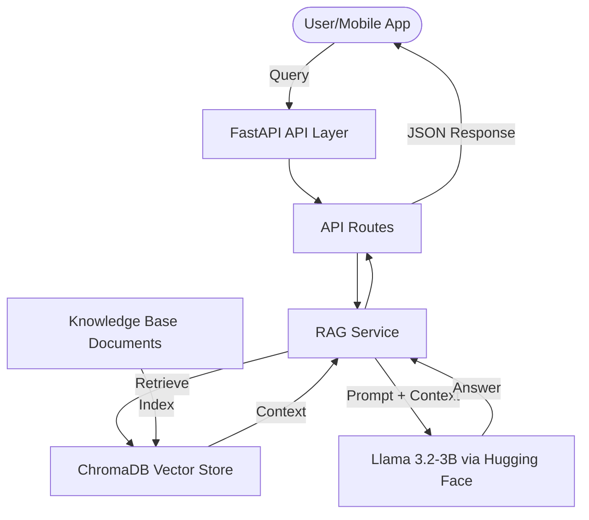

# Architecture & Tech Stack - Parking LLM Microservice

This document provides a detailed overview of the system architecture, component design, and technology stack used in the Parking LLM Microservice.

## 🏗️ System Architecture

The microservice follows a modular design pattern to ensure maintainability and scalability. It is built using FastAPI and integrates LangChain for the Retrieval-Augmented Generation (RAG) pipeline.

### Component Overview



## 🛠️ Tech Stack

### Core Frameworks
- **FastAPI**: A modern, high-performance web framework for building APIs with Python 3.8+ based on standard Python type hints.
- **LangChain**: A framework for developing applications powered by large language models (LLMs).

### LLM & Embeddings
- **Model**: `meta-llama/Llama-3.2-3B-Instruct` - Optimized for instructional tasks and efficient inference.
- **Embeddings**: `sentence-transformers/all-MiniLM-L6-v2` - Maps sentences & paragraphs to a 384 dimensional dense vector space.
- **Inference**: Hugging Face Serverless API (Inference Endpoints).

### Vector Database
- **ChromaDB**: An open-source embedding database. It makes it easy to build LLM apps by making knowledge, facts, and skills pluggable for LLMs.

### Infrastructure
- **Docker**: Used for containerization, ensuring consistent environments across development and production.
- **Hugging Face Spaces**: Primary deployment platform.

## 📂 Project Structure

```text
parking-llm/
├── src/
│   ├── api/          # API Route definitions
│   ├── core/         # Config and Constants
│   ├── models/        # Pydantic Schemas
│   ├── services/      # Business Logic (RAG Service)
│   └── main.py       # Application Entry Point
├── data/             # Knowledge Base files (.txt, .pdf)
├── chroma_db/        # Persisted vector database
├── Dockerfile        # Container configuration
└── ARCHITECTURE.md    # This document
```

## 🚀 Key Features
- **RAG Pipeline**: Dynamically retrieves context from a local knowledge base to provide factual answers.
- **Asynchronous API**: Built on top of `asyncio` for high-throughput request handling.
- **Auto-Indexing**: Automatically indexes documents in the `data/` folder on startup if the vector DB is empty.
- **Modular Design**: Separates configuration, data models, and services for easier maintenance.
